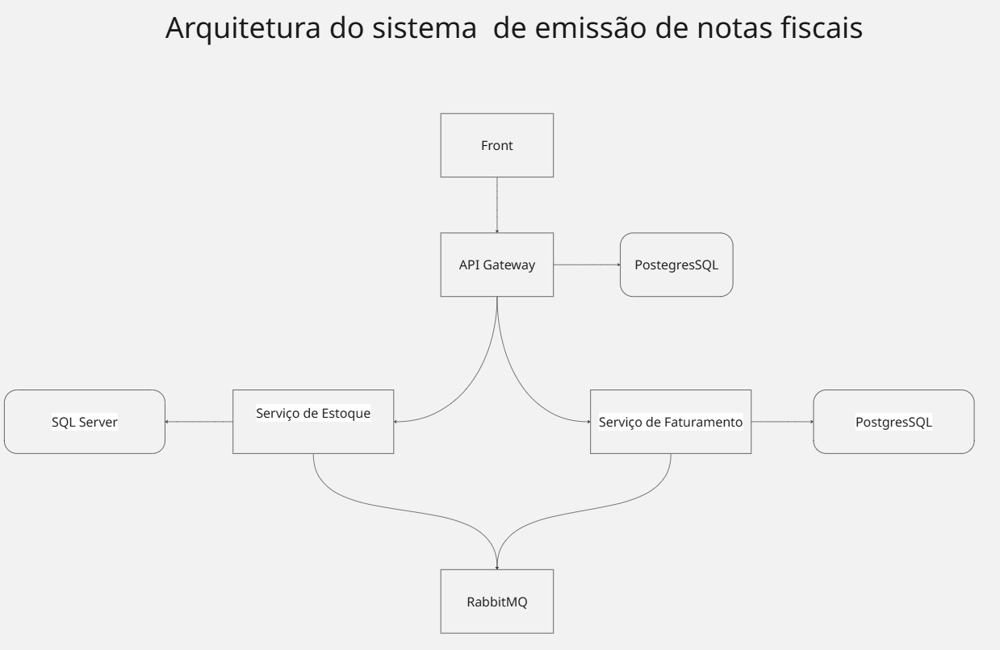

# Emissor NF

Sistema para emitir notas fiscais. Você cadastra produtos, abre uma nota, escolhe os itens e fecha — e ao fechar, o sistema desconta a quantidade do estoque. Se faltar saldo de qualquer item, a nota inteira é recusada e **nada** é descontado.

Ele é dividido em partes independentes, que conversam entre si por uma fila de mensagens.

Desafio técnico Korp · **Augusto Farias dos Santos**



A tela nunca fala direto com os serviços: tudo passa pelo **gateway**, que confere quem você é e encaminha. E os dois serviços não se chamam entre si — deixam recados numa fila.

---

## 1 · Subir

**Você só precisa ter o Docker instalado.** Não é preciso instalar .NET, Node nem banco de dados: o Docker monta tudo sozinho.

> **Vai querer testar a parte de IA?** Configure ela **antes** de rodar o comando abaixo — é rápido e está na [seção 4](#4--habilitar-a-ia-opcional). Se deixar para depois, vai precisar montar tudo de novo.
>
> Sem isso, o sistema funciona normal — só o assistente fica desligado.

```bash
docker compose --profile app up -d --build
```

Abra **http://localhost:5000** · `admin@admin.com` / `Admin123!`

> **Da primeira vez demora cerca de 1 minuto**, porque um dos bancos de dados é lento para iniciar. Se alguma tela disser *"não foi possível carregar"*, espere um pouco e clique em **Tentar novamente**.

Os bancos de dados são criados sozinhos. O sistema começa **vazio**: fora a conta de administrador acima, tudo que você vir na tela foi você que cadastrou.

---

## 2 · Os quatro projetos

| Projeto | Endereço | Banco de dados | O que faz |
|---|---|---|---|
| `API-Gateway/` | :5000 | PostgreSQL | Porta de entrada |
| `API-Estoque/` | :5247 | SQL Server | Cuida do estoque |
| `API-Faturamento/` | :5108 | PostgreSQL | Cuida das notas |
| `NotaFlow/` | :4200 | — | As telas |

**Gateway** é a portaria: faz o login, lembra que você está conectado e encaminha cada pedido para o serviço certo.

**Estoque** é o único que mexe no saldo dos produtos. Ninguém mais desconta estoque.

**Faturamento** cuida da nota: numeração, itens, fechamento e o PDF.

**NotaFlow** são as telas que você usa.

Estoque e Faturamento **não conversam direto**. Quando uma nota é fechada, o Faturamento deixa um recado numa fila e o Estoque pega esse recado quando puder. É isso que faz o sistema continuar funcionando mesmo se um deles cair.

---

## 3 · Usar

**1. Produtos → Novo produto.** Cadastre dois:

```
PAR-M8    Parafuso sextavado M8    saldo 10
MAR-BOR   Martelo de borracha      saldo 5
```

**2. Notas fiscais → Nova nota.** Nasce com número sequencial e status **Aberta**.

**3. Adicione itens** pelo campo de busca. Com a IA habilitada *(seção 4)*, use o campo roxo ✨: escreva `3 parafusos sextavados e dois martelos` e clique em **Interpretar** — ela propõe, você confirma.

**4. Fechar nota.** O botão mostra *Processando*: a API respondeu na hora e a baixa corre em segundo plano. Em segundos vira **Fechada**.

**5. Volte em Produtos.** O saldo caiu pela quantidade usada: `10 → 7`.

**6. Imprimir PDF** na nota fechada. Gerado no servidor, com a identidade do sistema.

---

## 4 · Habilitar a IA *(opcional)*

O sistema tem um assistente que monta os itens da nota a partir de uma frase em português. Ele é **opcional**: sem chave, todo o resto funciona e apenas esse recurso fica desligado.

### Passo 1 · Consiga uma chave

A mais simples é a do **Google Gemini**, gratuita: acesse [aistudio.google.com/apikey](https://aistudio.google.com/apikey), entre com uma conta Google e clique em *Create API key*. Leva um minuto e não pede cartão.

### Passo 2 · Abra o arquivo e cole a chave

```
API-Faturamento/Faturamento.Api/appsettings.json
```

> É o `appsettings.json` do **Faturamento**, não o do Gateway nem o do Estoque. A IA vive só nesse serviço.

Role até o fim. A seção `Ai` já está lá, **pronta para o Gemini** — só o campo `ApiKey` vem vazio.

*(Prefere OpenAI, Anthropic ou um modelo local? Dá para trocar — veja [logo abaixo](#-prefere-outra-ia-funciona-com-qualquer-uma).)*

```json
"Ai": {
  "BaseUrl": "https://generativelanguage.googleapis.com/v1beta/openai",
  "ApiKey": "",
  "Model": "gemini-3.6-flash",
  "MaxTokens": 1024,
  "TimeoutSeconds": 30
}
```

Cole sua chave entre as aspas do `ApiKey` e salve. **Nada mais precisa mudar** se for usar o Gemini:

```json
  "ApiKey": "AIzaSyC...sua-chave-aqui",
```

### Passo 3 · Só agora suba o sistema

```bash
docker compose --profile app up -d --build
```

> **Por que a ordem importa:** o Docker tira uma *cópia* do arquivo quando monta o sistema. Se você colar a chave depois de já ter subido tudo, ele continua usando a cópia antiga — sem a chave. Se foi o seu caso, rode o comando abaixo para refazer só a parte de notas:
>
> ```bash
> docker compose --profile app up -d --build faturamento
> ```

### Passo 4 · Confirme que ligou

```bash
docker compose --profile app logs faturamento | grep -i "IA desabilitada"
```

Esse comando procura por uma mensagem de aviso no sistema.

- **Não apareceu nada** → a IA está ligada, pode usar
- **Apareceu uma linha** → a chave não chegou; volte ao passo 2 e confira se salvou o arquivo

Na tela, abra uma nota **aberta**: deve haver um campo roxo com ✨ escrito *"Descreva o pedido e a IA monta os itens"*. Escreva `3 parafusos sextavados e dois martelos de borracha` e clique em **Interpretar**.

---

### O que cada campo faz

| Campo | Para quê |
|---|---|
| `BaseUrl` | **Qual empresa de IA** você vai usar. É só isto que muda entre Gemini, OpenAI e outros |
| `ApiKey` | Sua senha de acesso à IA. **Em branco = IA desligada**, e o resto funciona igual |
| `Model` | Qual modelo daquela empresa. De tempos em tempos modelos antigos saem do ar |
| `MaxTokens` | Tamanho máximo da resposta. 1024 é bem mais que o suficiente aqui |
| `TimeoutSeconds` | Quantos segundos esperar antes de desistir |

Você não escolhe a empresa numa lista porque não precisa: todas usam o mesmo jeito de conversar. Trocar de IA é trocar o endereço e o nome do modelo — **nenhuma linha de programação muda**.

### 🔄 Prefere outra IA? Funciona com qualquer uma

O projeto vem configurado para o **Gemini** porque a chave é gratuita — mas você não está preso a ele. Escolha qualquer uma das quatro:

| | Precisa de chave? | Custo |
|---|---|---|
| **Google Gemini** *(padrão)* | sim, gratuita | grátis |
| **OpenAI** | sim | pago |
| **Anthropic** | sim | pago |
| **Ollama** | não | grátis, roda na sua máquina |

Para trocar, **substitua a seção `Ai` inteira** por um dos blocos abaixo. Não é preciso mexer em mais nada — nem no código, nem em outro arquivo.

**OpenAI**

```json
"Ai": {
  "BaseUrl": "https://api.openai.com/v1",
  "ApiKey": "COLE-SUA-CHAVE-AQUI",
  "Model": "gpt-4o-mini",
  "MaxTokens": 1024,
  "TimeoutSeconds": 30
}
```

**Anthropic**

```json
"Ai": {
  "BaseUrl": "https://api.anthropic.com/v1",
  "ApiKey": "COLE-SUA-CHAVE-AQUI",
  "Model": "claude-haiku-4-5",
  "MaxTokens": 1024,
  "TimeoutSeconds": 30
}
```

**Ollama** — roda na sua própria máquina, sem pagar nada e sem criar conta

```json
"Ai": {
  "BaseUrl": "http://host.docker.internal:11434/v1",
  "ApiKey": "ollama",
  "Model": "llama3.2",
  "MaxTokens": 1024,
  "TimeoutSeconds": 120
}
```

Antes, instale o [Ollama](https://ollama.com), deixe-o aberto e baixe o modelo com `ollama pull llama3.2`. Como ele é mais lento que os outros, o tempo de espera está maior. Se estiver rodando o Faturamento pela IDE em vez do Docker, troque `host.docker.internal` por `localhost`.

### Se der errado

**O campo roxo não aparece na tela** — a IA está desligada. Rode o comando do passo 4.

**"Assistente indisponível"** — a chave chegou, mas a chamada falhou. Veja o motivo real:

```bash
docker compose --profile app logs faturamento | grep -i "Assistente indisponível" -A 3
```

- `401` ou `403` → chave inválida ou expirada
- `404 model not found` → o modelo saiu do ar; troque o `Model`
- `429` → limite de uso da conta atingido
- `503` → sobrecarga momentânea do fornecedor; o sistema já tenta 3 vezes, mas insista

**"Não identifiquei nenhum produto"** — não é erro. A IA só resolve produtos que **existem cadastrados**; cadastre-os antes de descrever o pedido.

**O serviço não sobe depois de editar** — provavelmente o JSON ficou inválido (vírgula sobrando ou faltando). Confira com:

```bash
docker compose --profile app logs faturamento | head -20
```

---

## 5 · Rodar sem Docker

Se quiser abrir o código e rodar cada parte pela sua IDE, dá. Só os bancos de dados e a fila continuam no Docker — instalar os três na mão daria muito trabalho e não muda nada no resultado.

Neste modo você precisa ter instalado:

| | Versão | Conferir com |
|---|---|---|
| .NET SDK | **10.0.400 ou maior** — versões antigas nem abrem o projeto | `dotnet --version` |
| Node.js | **20 ou maior** | `node --version` |
| Docker | qualquer versão | `docker --version` |

Primeiro suba só os bancos e a fila (repare que aqui **não tem** `--profile app`):

```bash
docker compose up -d
```

Depois abra quatro terminais, um para cada parte:

```bash
cd API-Gateway     && dotnet run --project Gateway          # :5000
cd API-Estoque     && dotnet run --project Estoque.Api      # :5247
cd API-Faturamento && dotnet run --project Faturamento.Api  # :5108
cd NotaFlow        && npm install && npm start              # :4200
```

**Você não precisa configurar nada** — os endereços dos bancos já vêm prontos no projeto.

Deixe o **Gateway por último**. Como tudo passa por ele, as telas só respondem quando Estoque e Faturamento já estiverem no ar.

Neste modo o endereço é **http://localhost:4200**, e não o :5000. É o endereço das telas, e ele já sabe conversar com o gateway por trás.

> Se tentar abrir o :5247 ou o :5108 direto no navegador, vai receber um erro de acesso negado. É proposital: esses serviços só aceitam pedidos que passaram pelo gateway.

---

## 6 · Quando algo der errado

**Página em branco ou erro 502 no :5000** — as telas não subiram. Se estiver usando Docker, veja o que aconteceu:

```bash
docker compose --profile app logs notaflow
```

Se estiver rodando pela IDE, o endereço certo é o **:4200**.

**"Não foi possível carregar" logo depois de subir** — um dos bancos ainda está iniciando. Espere alguns segundos e clique em **Tentar novamente**.

**A nota trava em "Processando"** — quer dizer que o serviço de estoque ou a fila não estão respondendo:

```bash
docker compose --profile app logs estoque
```

Depois de cerca de 1 minuto a nota vira **Pendente** e explica o que houve. **Nada é perdido:** suba o serviço e clique em fechar de novo — o sistema reconhece que é a mesma operação e não desconta o estoque duas vezes.

**A IA não responde** — veja a [seção 4](#4--habilitar-a-ia-opcional), que tem os erros mais comuns e o que fazer em cada um.

**"Porta já em uso"** — algum outro programa da sua máquina está ocupando uma das portas que o sistema usa (5000, 5432, 5433, 1433 ou 5672). Feche esse programa e tente de novo.

**Descobrir a causa exata de um erro** — sempre que o sistema mostra um erro, ele vem com um código de rastreio (`traceId`). Copie esse código e procure por ele:

```bash
docker compose --profile app logs faturamento | grep <traceId>
```

**Apagar tudo e recomeçar** — apaga inclusive os produtos e notas que você cadastrou:

```bash
docker compose --profile app down -v
docker compose --profile app up -d --build
```

---

## 7 · Stack

**Backend** · .NET 10 · ASP.NET Core · EF Core · MassTransit + RabbitMQ · YARP · Polly · QuestPDF · Argon2id
**Frontend** · Angular 21 · signals + `httpResource` · RxJS · Vitest
**Bancos** · PostgreSQL (gateway e faturamento) · SQL Server (estoque)

As decisões de arquitetura — outbox transacional, saga coreografada, idempotência, tratamento de erros, LINQ e o uso de IA — estão em **[`Documentacao/DetalhamentoTecnico.md`](Documentacao/DetalhamentoTecnico.md)**.

---

## 8 · Testes

Mais de **700**, nos quatro projetos. Os de integração sobem PostgreSQL, SQL Server e RabbitMQ de verdade, em contêineres descartáveis — por isso exigem Docker rodando.

```bash
cd API-Estoque     && dotnet test
cd API-Faturamento && dotnet test
cd API-Gateway     && dotnet test
cd NotaFlow        && npx ng test --watch=false
```

Só os unitários, sem Docker:

```bash
dotnet test Testes/TestesUnitarios
```

---

## 9 · Documentação

| Onde | O que tem |
|---|---|
| [`Documentacao/DetalhamentoTecnico.md`](Documentacao/DetalhamentoTecnico.md) | Detalhamento técnico da especificação |
| [`Documentacao/Back/`](Documentacao/Back/) | Arquitetura, domínio e testes de cada serviço |

Com a aplicação no ar: **API** em `/scalar/v1` · **RabbitMQ** em :15672 (`Admin`/`Admin`, vhost `emissor`).

---

## Configuração

Não há *user secrets*: connection strings e chaves de desenvolvimento estão versionadas para o projeto rodar com `git clone` e um comando.

A configuração é **obrigatória e validada no boot** — seção ausente derruba a inicialização nomeando a chave responsável, em vez de subir meio configurada. A única exceção é `Ai:ApiKey`, que pode ficar vazia.
